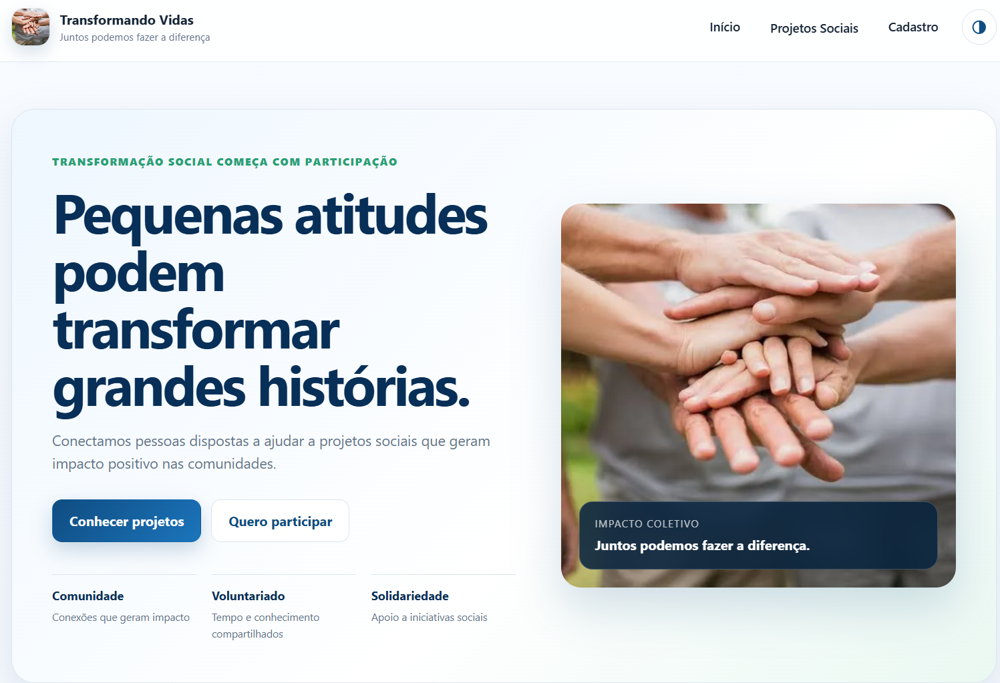
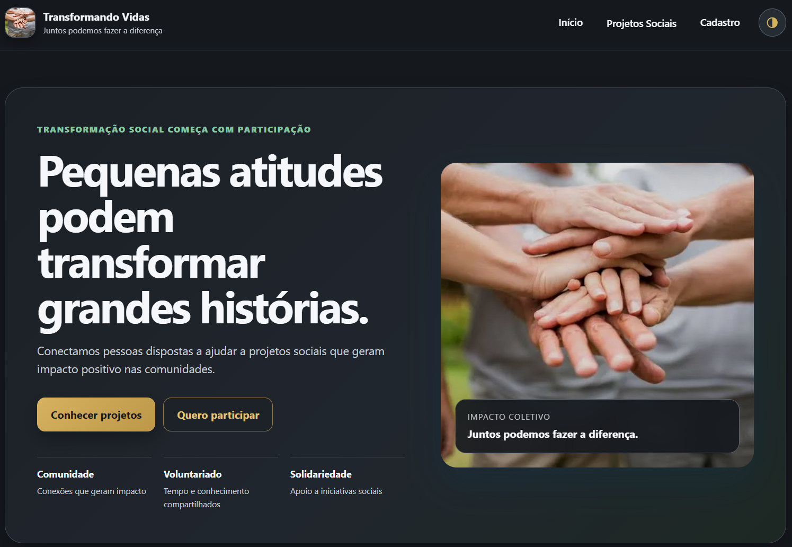
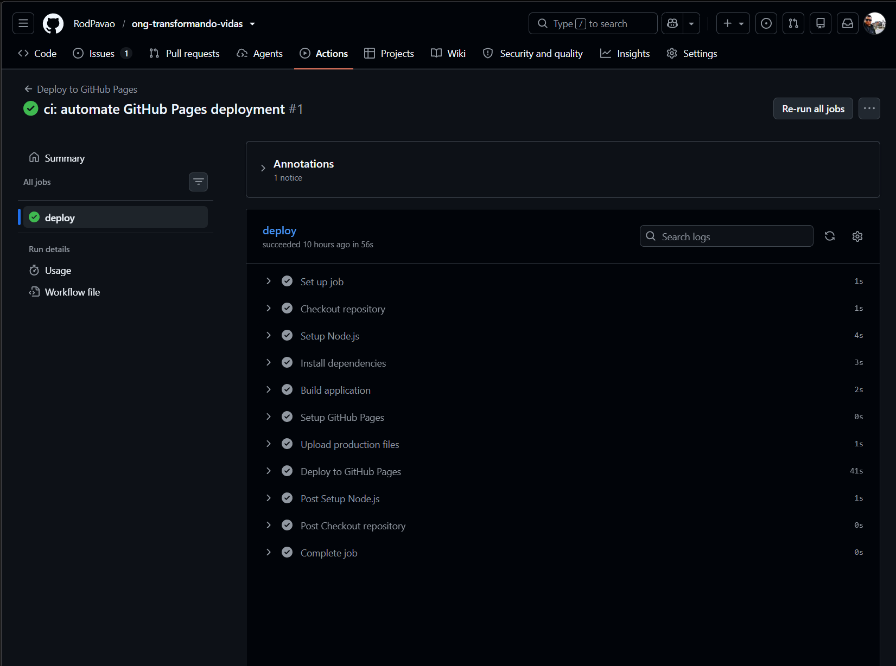
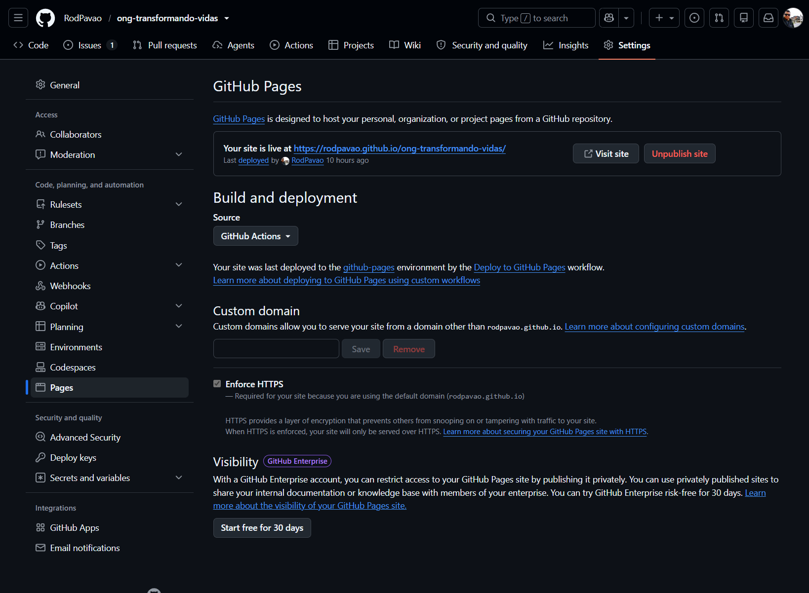

# ONG Transformando Vidas

A responsive web application developed as part of a Front-end Development academic project.

The project simulates the digital platform of a non-governmental organization (NGO), providing information about social initiatives, donations, volunteering opportunities, and user registration.

## Features

- Responsive web interface
- Dynamic navigation using JavaScript
- Hash-based client-side routing
- Donation and volunteering information
- User registration form
- HTML5 form validation
- Local storage for application data
- Responsive navigation menu
- Keyboard accessibility with a skip link
- Semantic HTML structure
- Accessibility attributes and feedback messages
- High-contrast interface support with persistent user preference

## Technologies

- HTML5
- CSS3
- JavaScript
- Web Storage API
- Vite
- Git
- GitFlow
- GitHub Pages

## Project Structure

```text
ong-transformando-vidas/
├── css/
│   └── style.css
├── html/
│   ├── cadastro.html
│   ├── index.html
│   └── projetos.html
├── imagens/
│   └── images-5-1.jpg
├── js/
│   ├── formulario.js
│   ├── main.js
│   ├── storage.js
│   └── templates.js
└── README.md
```

## Application Architecture

The application uses JavaScript modules to separate responsibilities:

- `main.js` manages navigation and dynamic page rendering.
- `templates.js` contains the dynamic views used by the application.
- `formulario.js` manages form behavior and validation.
- `storage.js` handles browser storage operations.

Navigation is based on URL hash routes, allowing different sections of the application to be rendered dynamically without reloading the entire document.

This modular organization separates navigation, presentation, form behavior, and storage responsibilities, making the code easier to maintain, test, and extend.

## Accessibility

The project includes accessibility improvements such as:

- Semantic HTML elements
- Form labels associated with their respective fields
- `fieldset` and `legend` elements for grouped form data
- ARIA attributes for the responsive navigation menu
- Dynamic ARIA states such as `aria-expanded` and `aria-pressed`
- Status and alert roles for user feedback
- Descriptive alternative text for images
- Keyboard-accessible skip link to the main content
- High-contrast mode with persistent preference stored in `localStorage`

These decisions treat accessibility as part of the application architecture rather than as a final visual adjustment.

## Running Locally

The application can be executed locally without requiring a production build.

To run the project locally:

1. Clone or download the repository.
2. Open the project folder in Visual Studio Code.
3. Open `html/index.html`.
4. Run the page using the Live Server extension or another local HTTP server.
5. Access the local address provided by the server in the browser.

A local HTTP server is recommended because the application uses JavaScript ES modules.

## Deployment

The production version of the application is generated with Vite and deployed to GitHub Pages.

Vite is used to prepare the optimized production files in the `dist` directory, including the processing and minification of static resources. GitHub Pages was selected because the application is entirely Front-end and does not require a Back-end server for execution.

The deployment workflow keeps the source code, version history, and published application integrated with the same GitHub repository.

### SPA Routing Strategy

The application uses hash-based routing (`#`) for client-side navigation.

This approach was selected because hash routing does not require additional server configuration, rewrite rules, or route redirection. The URL fragment after the `#` character is handled directly by the browser and is not interpreted by the hosting server as a separate file path.

For this reason, hash-based routing is compatible with the static hosting model used by GitHub Pages while still allowing the application to provide SPA-style navigation without reloading the entire page.

## Screenshots

### Published Application

The application is publicly available through GitHub Pages.

#### Default Interface



#### High-Contrast Mode



### Automated Deployment

The production deployment is automated with GitHub Actions. Every push or merged change to the `main` branch triggers the workflow responsible for installing dependencies, building the application with Vite, uploading the production artifact, and publishing it to GitHub Pages.

#### GitHub Actions Deployment Workflow



#### GitHub Pages Configuration



## Version Control

The project uses Git with a workflow based on GitFlow:

- `main` represents stable versions.
- `develop` integrates ongoing development.
- `feature/*` branches isolate new features before integration into `develop`.

Commit messages follow semantic conventions to keep the project history clear and traceable.

Issues and milestones are used to organize development tasks and maintain a record of the work performed throughout the project.

## Academic Context

This project was developed during the Front-end Development discipline of the Systems Analysis and Development degree program.

Its purpose is to apply concepts involving HTML5, CSS3, JavaScript, accessibility, responsive interfaces, browser storage, Single Page Application architecture, version control, deployment, and technical documentation.

## Author

Rodrigo de Carvalho Pavão